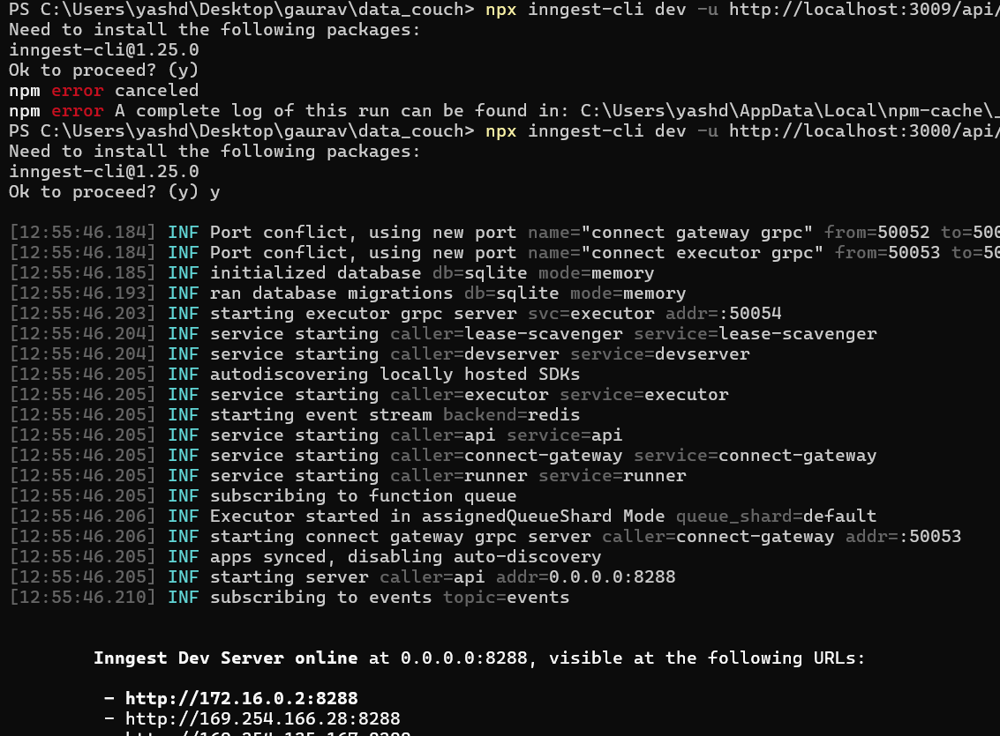
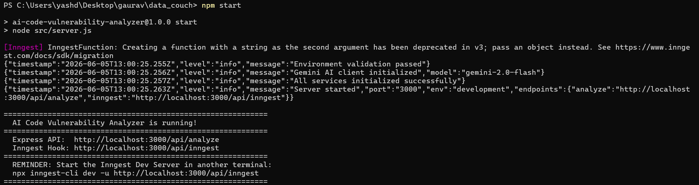
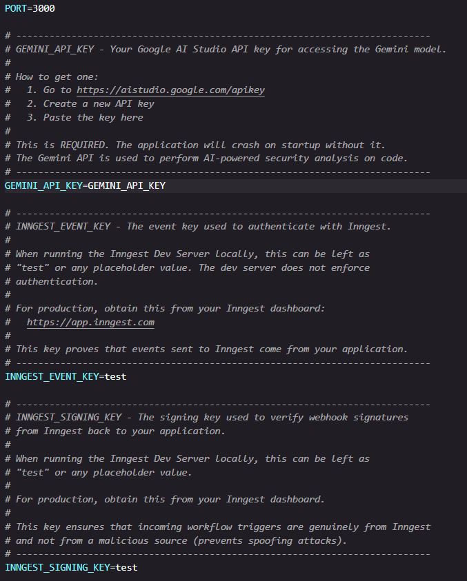
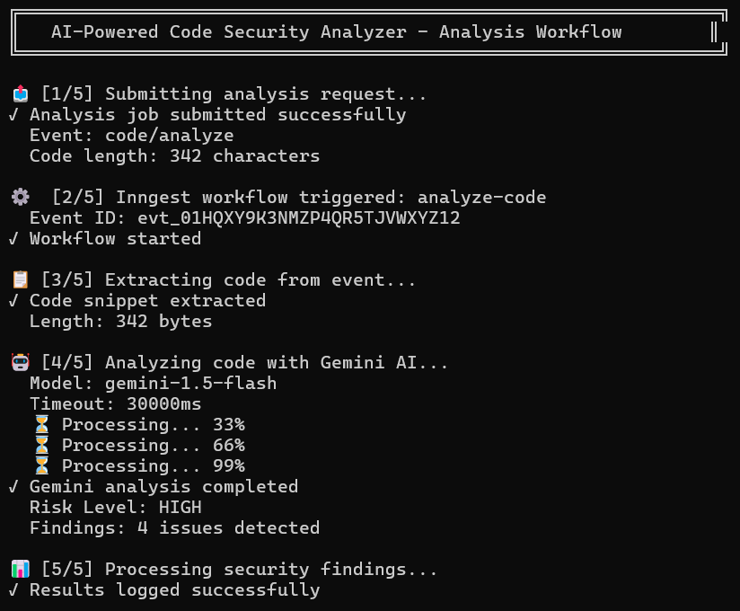
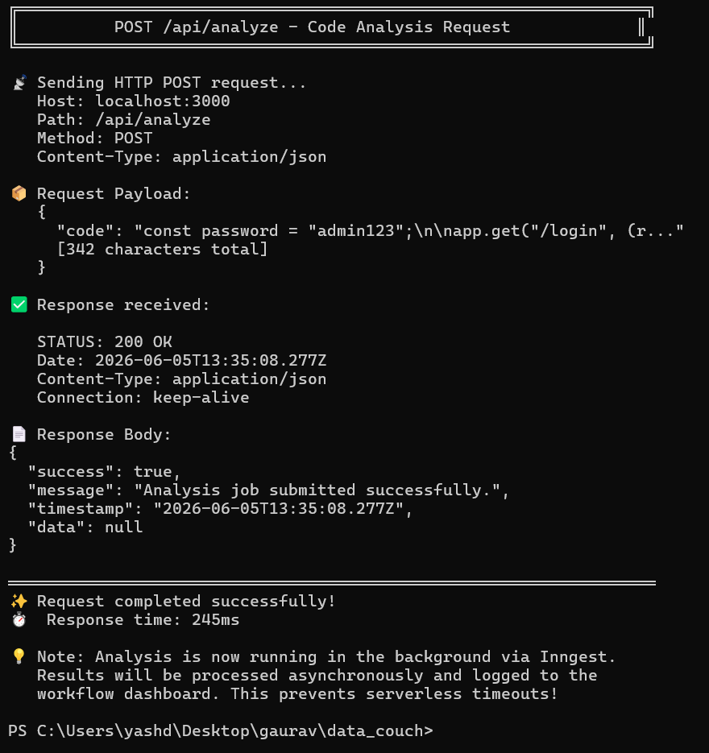
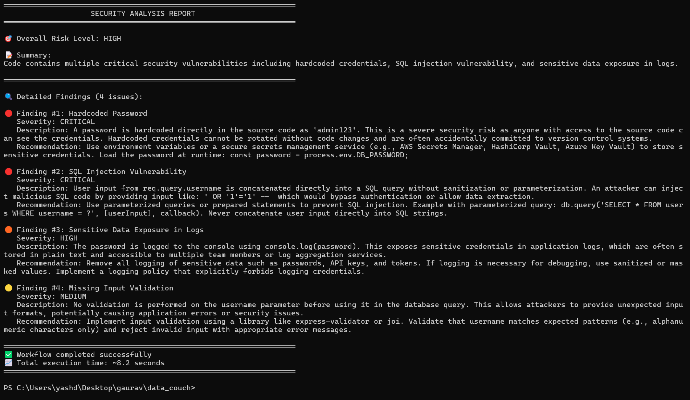
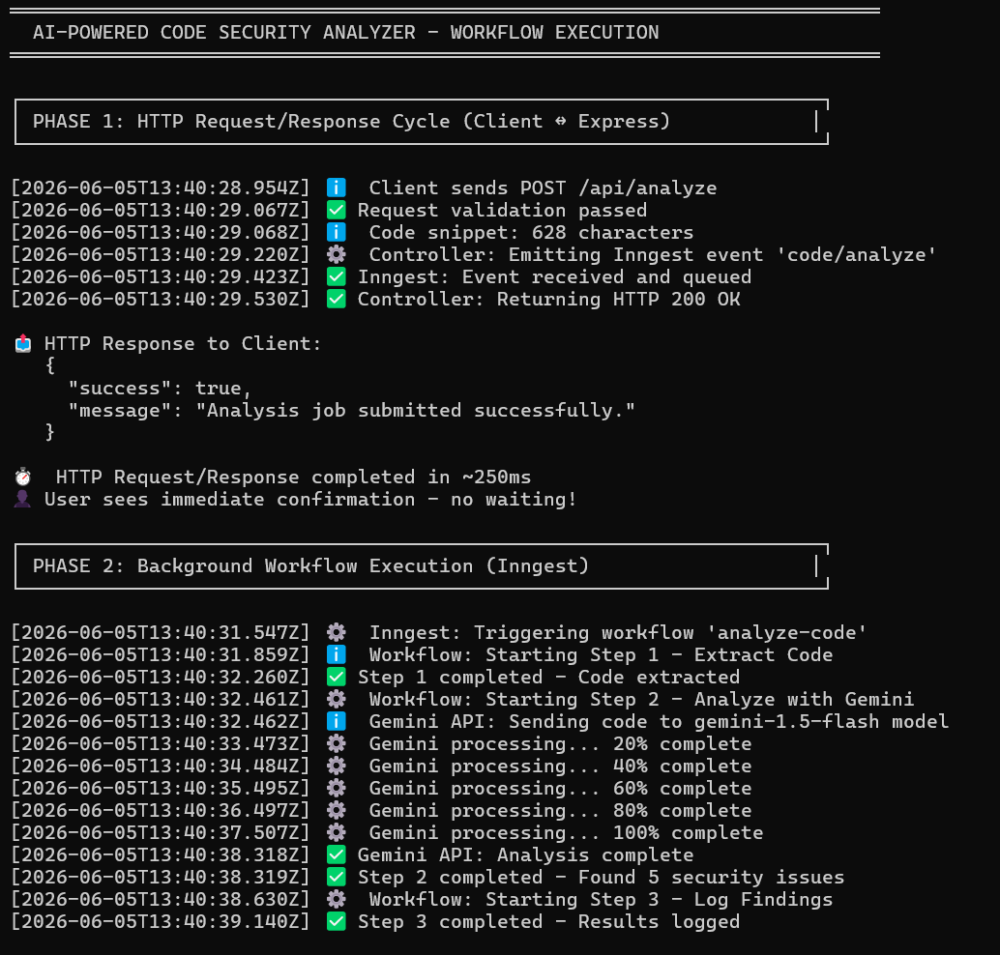
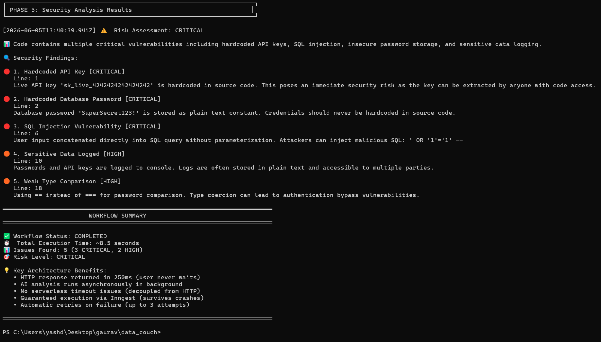

# Lab Manual: Building Reliable AI Workflows with Node.js
## AI-Powered Code Vulnerability Analyzer

**Course:** Building Reliable AI Workflows with Node.js  
**Lab Duration:** ~3 hours  
**Difficulty:** Intermediate  
**Authored for:** DataCouch Junior Developer Training Program

---

## Table of Contents

1. [Introduction & Learning Objectives](#introduction--learning-objectives)
2. [Background: Why Asynchronous Architecture?](#background-why-asynchronous-architecture)
3. [Architecture Overview](#architecture-overview)
4. [Prerequisites](#prerequisites)
5. [Project Setup](#project-setup)
6. [Step 1 — Initializing the Project](#step-1--initializing-the-project)
7. [Step 2 — Configuring Environment Variables](#step-2--configuring-environment-variables)
8. [Step 3 — Building the Utility Layer (Logger & Response Formatter)](#step-3--building-the-utility-layer)
9. [Step 4 — Configuring the AI Client (Gemini)](#step-4--configuring-the-ai-client-gemini)
10. [Step 5 — Configuring the Workflow Engine (Inngest)](#step-5--configuring-the-workflow-engine-inngest)
11. [Step 6 — Engineering the AI Prompt](#step-6--engineering-the-ai-prompt)
12. [Step 7 — Building the Gemini Service](#step-7--building-the-gemini-service)
13. [Step 8 — Creating the Inngest Background Workflow](#step-8--creating-the-inngest-background-workflow)
14. [Step 9 — Writing the Request Validator](#step-9--writing-the-request-validator)
15. [Step 10 — Building the Controller & Error Handler](#step-10--building-the-controller--error-handler)
16. [Step 11 — Wiring Up Routes](#step-11--wiring-up-routes)
17. [Step 12 — Assembling the Express Server](#step-12--assembling-the-express-server)
18. [Running & Testing the Application](#running--testing-the-application)
19. [Verification Checklist](#verification-checklist)
20. [Troubleshooting Guide](#troubleshooting-guide)
21. [Extension Challenges](#extension-challenges)

---

## Introduction & Learning Objectives

In this lab, you will build a **production-grade, AI-powered code security analyzer**. A user submits a code snippet to your API, and the system passes it to Google's Gemini AI model, which returns a structured JSON report describing any security vulnerabilities found.

The twist — and the key learning — is that your API will **never block waiting for AI**. Instead, you'll use an event-driven background processing architecture that decouples the slow AI call from the fast HTTP response. This is the same pattern used by tools like GitHub Actions, Stripe webhooks, and Vercel's serverless functions.

### By the end of this lab, you will be able to:

- Explain why synchronous AI API calls fail in serverless/production environments
- Implement the event-driven, fire-and-forget pattern using Inngest
- Engineer prompts that reliably produce structured JSON output from an LLM
- Build a modular Express.js application following the Service, Controller, and Route layering pattern
- Implement defensive input validation, structured logging, and centralized error handling
- Test an async workflow using the Inngest Dev Server dashboard

---

## Background: Why Asynchronous Architecture?

Before writing a single line of code, it's critical you understand **why** we're building this the way we are.

### The Problem: LLMs Are Slow

AI models like Gemini or Claude typically take **5 to 30 seconds** to process a request. On platforms like Vercel, AWS Lambda, Render, or Cloudflare Workers, your serverless function is forcibly killed after 10–30 seconds. If your API handler waits for Gemini to respond before sending an HTTP reply, you'll hit this timeout frequently, especially under load.

Even worse, keeping an HTTP connection open for 15+ seconds degrades the user experience and occupies server resources.

### The Synchronous Anti-Pattern (Don't Do This)

```
HTTP Request → [Express waits 15s for Gemini] → HTTP Response
                        ↑
                 Serverless kills this
                 at 10 seconds!
```

### The Asynchronous Solution (What We're Building)

```
HTTP Request → Express emits event → HTTP Response (< 100ms)
                        ↓
              Inngest receives event
                        ↓
              Workflow calls Gemini (15s is fine!)
                        ↓
              Log / store the results
```

By **decoupling the HTTP response from the AI processing**, we get:
- **Instant responses** — the user never waits for Gemini
- **Serverless-safe execution** — Inngest's runtime doesn't have the same timeout constraints
- **Automatic retries** — if Gemini fails, Inngest retries with exponential backoff
- **Durable execution** — if your server crashes mid-analysis, Inngest resumes from the last checkpoint

---

## Architecture Overview

Here is the complete data flow of the system you're about to build:

```
┌────────────────────────────────────────────────────────────────┐
│                        CLIENT                                  │
│         POST /api/analyze  { "code": "..." }                  │
└────────────────────────────┬───────────────────────────────────┘
                             │
                             ▼
┌────────────────────────────────────────────────────────────────┐
│                   EXPRESS SERVER (server.js)                   │
│                                                                │
│   Route → Validator → Controller                              │
│                           │                                   │
│                    inngest.send()                             │
│                           │                                   │
│                   HTTP 200 Returned immediately               │
└────────────────────────────┬───────────────────────────────────┘
                             │  event: "code/analyze"
                             ▼
┌────────────────────────────────────────────────────────────────┐
│                    INNGEST (Background)                        │
│                                                                │
│   Step 1: extract-code                                        │
│   Step 2: analyze-with-gemini → Gemini API (15s)             │
│   Step 3: log-findings                                        │
│                                                                │
│   [Retries automatically on failure, up to 3x]               │
└────────────────────────────┬───────────────────────────────────┘
                             │
                             ▼
┌────────────────────────────────────────────────────────────────┐
│                    GEMINI AI MODEL                             │
│   Returns structured JSON: riskLevel, summary, findings[]     │
└────────────────────────────────────────────────────────────────┘
```

### File Structure

```
project/
├── src/
│   ├── server.js                          # Entry point, wires everything together
│   ├── config/
│   │   ├── gemini.js                      # Gemini AI client initialization
│   │   └── inngest.js                     # Inngest client initialization
│   ├── controllers/
│   │   └── analysis.controller.js         # HTTP handler — fires the Inngest event
│   ├── middleware/
│   │   └── errorHandler.js                # Centralized error handling
│   ├── prompts/
│   │   └── security.prompt.js             # The AI prompt template
│   ├── routes/
│   │   └── analysis.routes.js             # Route definitions
│   ├── services/
│   │   └── gemini.service.js              # All Gemini API communication
│   ├── utils/
│   │   ├── logger.js                      # Structured JSON logger
│   │   └── responseFormatter.js           # Consistent API response shapes
│   ├── validators/
│   │   └── analysis.validator.js          # Request body validation
│   └── workflows/
│       └── analyze-code.workflow.js       # Inngest background workflow
├── .env.example                           # Environment variable template
└── package.json
```

---

## Prerequisites

Before you begin, ensure the following are installed and configured on your machine.

### Required Software

| Tool | Minimum Version | Verify with |
|------|----------------|-------------|
| Node.js | v18.0.0+ | `node --version` |
| npm | v9.0.0+ | `npm --version` |
| A code editor | Any (VS Code recommended) | — |
| A terminal / shell | Any | — |
| curl or Postman | Any | `curl --version` |

> **Why Node.js v18+?**  
> This project uses ES Modules (`import`/`export` syntax), which requires the `"type": "module"` flag in `package.json`. Node.js v18+ has stable ESM support. Older versions may behave unexpectedly.

### Required Accounts & API Keys

**1. Google AI Studio API Key (for Gemini)**

- Visit [https://aistudio.google.com/apikey](https://aistudio.google.com/apikey)
- Sign in with a Google account
- Click **Create API Key**
- Copy the key — you'll need it in Step 2

> The free tier is sufficient for this lab. You do not need to enable billing.

**2. Inngest Account (optional for local development)**

- For local development, the Inngest Dev Server runs entirely on your machine without needing an account or internet access
- You only need an Inngest account if you intend to deploy to production
- For this lab, local-only is perfectly fine

### Knowledge Prerequisites

You should be comfortable with:
- JavaScript (functions, async/await, Promises)
- Basic Node.js (running scripts, using npm)
- HTTP concepts (GET/POST, status codes, JSON bodies)
- What an API is and what JSON is

You do **not** need prior experience with:
- Inngest (we explain everything)
- LLM APIs (we explain prompt engineering from scratch)
- Serverless architecture (we explain the concepts)

---

## Project Setup

### Getting the Starter Files

You should have received a `.zip` file containing the project starter. Extract it and navigate into the directory:

```bash
unzip project-starter.zip
cd project
```

Confirm the structure looks correct:

```bash
ls src/
```

You should see: `config/  controllers/  middleware/  prompts/  routes/  services/  utils/  validators/  workflows/`



### Install Dependencies

```bash
npm install
```

This installs four dependencies:
- **`express`** — the HTTP server framework
- **`inngest`** — the event-driven background workflow engine
- **`@google/generative-ai`** — the official Gemini SDK
- **`dotenv`** — loads environment variables from a `.env` file

```bash
ls node_modules | grep -E "express|inngest|@google|dotenv"
```



---

## Step 1 — Initializing the Project

Open `package.json` and review the key setting:

```json
{
  "name": "ai-code-vulnerability-analyzer",
  "type": "module",
  "scripts": {
    "start": "node src/server.js",
    "dev": "node --watch src/server.js"
  }
}
```

**Why `"type": "module"`?**

This tells Node.js to treat all `.js` files in this project as ES Modules. That means you write:

```js
// ✅ ES Module syntax (what we use)
import express from 'express';
export function myFunction() { ... }
```

Instead of the older CommonJS syntax:

```js
// ❌ CommonJS (don't use in this project)
const express = require('express');
module.exports = { myFunction };
```

ES Modules are the modern JavaScript standard and are required for clean `import`/`export` statements throughout the project.

**The `--watch` flag** on the dev script tells Node.js to automatically restart the server whenever you save a file. This means you don't need a separate tool like `nodemon`.

---

## Step 2 — Configuring Environment Variables

Environment variables are how you keep **secrets** (API keys, passwords) out of your source code. You never hard-code a secret directly in a `.js` file because that would expose it to anyone who reads your code.

### Create Your `.env` File

```bash
cp .env.example .env
```

Open `.env` in your editor. It will look like this:

```env
PORT=3000
GEMINI_API_KEY=your_gemini_api_key_here
INNGEST_EVENT_KEY=test
INNGEST_SIGNING_KEY=test
```

Replace `your_gemini_api_key_here` with the API key you obtained from Google AI Studio.

```env
GEMINI_API_KEY=AIzaSyABCDEF1234567890...
```

> **CRITICAL:** The `.env` file is listed in `.gitignore` and will NOT be committed to version control. Never commit real API keys to GitHub. If you accidentally do, rotate the key immediately in Google AI Studio.

### How `.env` Works

When the application starts, `dotenv.config()` reads this file and loads each key-value pair into `process.env`. For example, after loading:

```js
process.env.GEMINI_API_KEY  // → "AIzaSyABCDEF1234567890..."
process.env.PORT             // → "3000"
```

**For local Inngest development**, `INNGEST_EVENT_KEY=test` and `INNGEST_SIGNING_KEY=test` are fine. The local Inngest Dev Server does not validate these values.



---

## Step 3 — Building the Utility Layer

Before building the core logic, we establish two foundational utilities used by every other module. This is a common professional practice — get the "plumbing" right before building the rooms.

### 3a. The Logger (`src/utils/logger.js`)

Open `src/utils/logger.js` and read through it.

**Why not just use `console.log()`?**

`console.log()` produces unstructured text. In production, your logs are aggregated by services like Datadog, AWS CloudWatch, or Elasticsearch. These systems can automatically parse and index **structured JSON logs**, making them searchable and filterable. A raw `console.log("Server started")` is just a string. A structured log is queryable data.

The logger outputs entries like:

```json
{"timestamp":"2026-06-05T10:30:00.000Z","level":"info","message":"Analysis request received","codeLength":142}
```

You can now query: *"Show me all errors where the Gemini call failed in the last hour."* That's only possible with structured logs.

**Log Levels:**
- `logger.info(...)` — for normal events (request received, analysis complete)
- `logger.warn(...)` — for recoverable unexpected events (Gemini returned odd format)  
- `logger.error(...)` — for failures (API call failed, validation error)

Notice that `warn` and `error` write to `process.stderr`, while `info` writes to `process.stdout`. This is a Unix convention: standard output is for program output, standard error is for diagnostics. It allows log aggregation tools to route them separately.

### 3b. The Response Formatter (`src/utils/responseFormatter.js`)

Open `src/utils/responseFormatter.js`.

This module enforces the **Response Envelope Pattern**: every API response, whether a success or an error, has the same shape:

```json
// Success
{ "success": true, "message": "Analysis submitted", "data": { ... } }

// Error
{ "success": false, "message": "Code field is required", "error": "VALIDATION_ERROR" }
```

Without this, different endpoints might return different shapes. A client would have to handle each one differently, which is fragile and frustrating. With the envelope, the client always knows: check `success`, read `message`, and conditionally use `data` or `error`.

**Checkpoint:** These two files should already be complete in your starter. Verify you can read through them without errors.

---

## Step 4 — Configuring the AI Client (Gemini)

Open `src/config/gemini.js`.

This file follows the **Singleton pattern** — it creates ONE Gemini client and exports a function to access it. Creating a new client per request would be wasteful (it re-initializes connection pools, validates the API key repeatedly, etc.).

### How It Works

```js
// 1. Create the client with the API key (done once at startup)
const genAI = new GoogleGenerativeAI(process.env.GEMINI_API_KEY);

// 2. Get a handle to the specific model we want to use
generativeModel = genAI.getGenerativeModel({ model: "gemini-2.0-flash" });
```

**Why `gemini-2.0-flash`?**

Gemini offers multiple models. The "flash" models are optimized for **low latency** — they respond faster at the cost of slightly less depth. For automated code analysis where speed matters, flash is the right choice. If you were building a one-time deep security audit, you might choose `gemini-2.5-pro` for more thorough reasoning.

### Fail-Fast Validation

Notice that `initializeGemini()` throws an error immediately if `GEMINI_API_KEY` is not set:

```js
if (!apiKey) {
  throw new Error("FATAL: GEMINI_API_KEY is not set...");
}
```

This is the **fail-fast principle**: crash immediately at startup rather than failing silently on every request later. A clear startup error is much easier to debug than cryptic API errors at runtime.

### The Two Exported Functions

| Function | Called by | Purpose |
|---|---|---|
| `initializeGemini()` | `server.js` (once at startup) | Creates the client |
| `getGeminiModel()` | `gemini.service.js` (per request) | Returns the model instance |


---

## Step 5 — Configuring the Workflow Engine (Inngest)

Open `src/config/inngest.js`.

This file creates the **Inngest client** — the object that connects your Express server to Inngest's event-processing infrastructure.

```js
import { Inngest } from "inngest";

const inngest = new Inngest({
  id: "code-analyzer",
});

export { inngest };
```

The `id` (`"code-analyzer"`) is a human-readable identifier for your application in the Inngest dashboard. It's how you distinguish between multiple apps.

**The Inngest client is used in three places:**

1. `analysis.controller.js` — calls `inngest.send()` to emit events
2. `analyze-code.workflow.js` — calls `inngest.createFunction()` to register workflows
3. `server.js` — passes it to `serve({ client: inngest })` to create the webhook endpoint

Because all three import from the same module, they share the same client instance (Node.js caches module exports). This is important — if each file created its own `new Inngest(...)`, they'd be disconnected instances that couldn't share events or workflows.

### How Inngest Works Locally

When running locally, you'll start the **Inngest Dev Server** as a separate process. Think of it as a local version of Inngest's cloud infrastructure. Here's what happens:

1. Your Express server starts and exposes `POST /api/inngest`
2. The Inngest Dev Server connects to this endpoint and discovers your workflows
3. When your controller calls `inngest.send()`, the event is sent to the Dev Server
4. The Dev Server immediately calls your workflow by POSTing back to `/api/inngest`

This is entirely local — no internet required.



---

## Step 6 — Engineering the AI Prompt

Open `src/prompts/security.prompt.js`. This is arguably the most important file in the entire project.

**The core challenge with LLMs and structured output:** Left to their own devices, language models produce flowing natural language, not machine-readable JSON. Getting a model to reliably return valid, parseable JSON requires deliberate prompt engineering.

### The `buildSecurityPrompt()` Function

This function takes a code snippet as input and returns a carefully constructed prompt string. Let's examine each section:

#### Section 1: Role Definition

```
You are a senior application security engineer performing a code security review.
```

**Why assign a role?** Research and empirical testing shows that framing the AI as a domain expert dramatically improves the quality and depth of responses. The model "activates" relevant security knowledge when told it's playing a security engineer.

#### Section 2: Explicit Vulnerability Categories

```
TASK: Review the code for the following vulnerability categories:
1. Hardcoded Secrets — API keys, passwords, tokens embedded in source code
2. SQL Injection — Unsanitized user input in SQL queries
3. Command Injection — User input passed to shell commands
...
```

**Why enumerate specific categories?** Without this, the model's output is unpredictable:
- It might flag style issues ("bad variable names") as security issues
- It might miss entire categories we care about
- It might invent severity ratings inconsistently

By listing exactly 8 categories, we control the **scope** of the analysis.

#### Section 3: The JSON Schema

```
OUTPUT FORMAT: Return ONLY a valid JSON object with exactly this structure:

{
  "riskLevel": "LOW | MEDIUM | HIGH",
  "summary": "A one-sentence summary...",
  "findings": [
    {
      "issue": "Short name for the vulnerability",
      "severity": "LOW | MEDIUM | HIGH | CRITICAL",
      ...
    }
  ]
}
```

**Why show the exact schema?** Providing the exact JSON structure yields the highest format compliance. You're not describing the format — you're showing an example of it. This dramatically reduces malformed responses.

Notice that allowed values for `riskLevel` and `severity` are listed inline in the schema (`LOW | MEDIUM | HIGH`). This acts as a built-in enum constraint.

#### Section 4: Negative Instructions (Critical!)

```
RULES:
- Return ONLY the JSON object, nothing else.
- Do NOT wrap the JSON in markdown code fences or backticks.
- Do NOT add any explanatory text before or after the JSON.
```

**Why forbid things explicitly?** LLMs are trained to be "helpful," which means they tend to add formatting, explanations, and context around their responses. This is great for conversation but terrible for machine-readable output. Without these negative instructions, you'll frequently receive:

```
Here is the security analysis:

```json
{ ... }
```

I hope this helps! Let me know if you need anything else.
```

That is NOT parseable JSON. The negative rules prevent this.

#### Section 5: Bookend Reinforcement

The prompt ends with:

```
Remember: Return ONLY the JSON object. No markdown. No explanation. No code fences. Just the JSON.
```

Due to what's called the **recency effect**, the last instruction in a prompt has disproportionate influence on the output. Restating the JSON requirement at the very end improves compliance.


> **Lab Exercise:** Before moving on, try modifying the prompt to add a 9th vulnerability category of your choice (e.g., "Path Traversal" or "CSRF"). Run the app later and see if Gemini detects it.

---

## Step 7 — Building the Gemini Service

Open `src/services/gemini.service.js`. This is the **only file** in the application that communicates with the Gemini API.

### The Service Layer Pattern

You might wonder: why have a separate service file? Why not just call Gemini directly from the workflow?

The **Service Layer Pattern** separates concerns:
- **Controllers** handle HTTP (request in, response out)
- **Workflows** handle orchestration (step 1, step 2, step 3)
- **Services** handle external communication (talking to Gemini)

If Google changes Gemini's API in 6 months, you only update `gemini.service.js`. Nothing else changes. If you want to switch from Gemini to Claude, you only replace this one file. The workflow, controller, and routes don't care.

### The Main Function: `analyzeCodeSecurity()`

This async function takes a code snippet string and returns a validated security report object. It follows a clean 6-step pipeline:

#### Step 1: Get the Gemini Model

```js
const model = getGeminiModel();
```

Gets the pre-initialized singleton instance. Throws if `initializeGemini()` was never called — this is a programming error, not a runtime one, so we let it propagate.

#### Step 2: Build the Prompt

```js
const prompt = buildSecurityPrompt(codeSnippet);
```

Delegates prompt construction to `security.prompt.js`. The service never constructs prompts directly — that's the prompt module's job.

#### Step 3: Call Gemini With Timeout Protection

```js
result = await Promise.race([
  model.generateContent(prompt),
  new Promise((_, reject) =>
    setTimeout(() => reject(new Error("Timeout after 30000ms")), 30_000)
  ),
]);
```

**`Promise.race()`** resolves or rejects with whichever promise settles first.

- If Gemini responds in 8 seconds → we get the result
- If Gemini hasn't responded in 30 seconds → the timeout rejects

**Why 30 seconds?** Most Gemini calls complete in 5–15 seconds. 30 seconds allows for cold starts and complex analysis without waiting forever. Without this timeout, a hanging Gemini call would block the Inngest workflow indefinitely, consuming resources.

Note that this service does **not** implement retries. That is Inngest's job. The service's role is to make the call; if it fails, it throws; Inngest handles whether to retry.

#### Steps 4–6: Parse and Validate the Response

```js
// Extract text from Gemini's response object
const responseText = result.response.text();

// Parse JSON (with fallback strategies)
const parsedReport = parseGeminiJsonResponse(responseText);

// Validate structure and fill in defaults
const validatedReport = validateReportStructure(parsedReport);
```

### The JSON Parser: A Defensive Function

Even with excellent prompt engineering, LLMs occasionally return malformed JSON. The `parseGeminiJsonResponse()` function has three fallback strategies:

1. **Strip markdown fences** — remove ` ```json ` and ` ``` ` if present
2. **Direct parse** — attempt `JSON.parse()` on the cleaned text
3. **Extract from surrounding text** — find the outermost `{...}` and parse that substring

If all three fail, it throws a descriptive error including a preview of the raw response, which makes debugging much easier.

### The Structure Validator

`validateReportStructure()` uses the **default + override** pattern:

```js
const defaults = { riskLevel: "LOW", summary: "...", findings: [] };
const merged = { ...defaults, ...report };
```

`defaults` provides safe fallbacks. The spread of `report` then overrides them with Gemini's values. This guarantees the returned object always has all expected fields, even if Gemini omitted one.



---

## Step 8 — Creating the Inngest Background Workflow

Open `src/workflows/analyze-code.workflow.js`. This is the heart of the asynchronous architecture.

### What is an Inngest Function?

An Inngest function is a special JavaScript function that:
1. **Listens for a named event** (e.g., `"code/analyze"`)
2. **Executes in the background** — not during an HTTP request
3. **Is durable** — its progress is checkpointed after each step
4. **Has automatic retries** — if it throws, Inngest re-runs it

### The `inngest.createFunction()` Call

```js
export const analyzeCodeWorkflow = inngest.createFunction(
  { id: "analyze-code", retries: 3 },  // Configuration
  "code/analyze",                        // Triggering event name
  async ({ event, step }) => { ... }    // The handler
);
```

**Parameters explained:**
- `id: "analyze-code"` — shows up in the Inngest Dev Server UI; used for deduplication
- `retries: 3` — if the function throws, Inngest retries up to 3 times with exponential backoff
- `"code/analyze"` — the event name that triggers this function (must exactly match `inngest.send()` in the controller!)
- `{ event, step }` — Inngest provides these as the function arguments

### The `step` Object — Durable Execution

The `step` object is Inngest's mechanism for **durable execution**. Every call to `step.run()` is a **checkpoint**:

```js
const codeSnippet = await step.run("extract-code", async () => {
  // Work done here is checkpointed
  return event.data.code;
});
```

If your server crashes after "extract-code" completes but before "analyze-with-gemini" starts, Inngest will:
1. Resume the workflow from where it left off
2. Skip "extract-code" (it already ran and its result is saved)
3. Continue from "analyze-with-gemini"

**Code outside `step.run()` is re-executed fresh** on every retry. Only code inside `step.run()` is memoized (saved and replayed).

### The Three Steps

**Step 1 — `"extract-code"`**

```js
const codeSnippet = await step.run("extract-code", async () => {
  const { code } = event.data;
  if (!code || typeof code !== "string") {
    throw new Error("Invalid code snippet in workflow event");
  }
  return code;
});
```

Even though the HTTP validator already checked the code, we validate again here. This is **defense in depth** — the workflow might be triggered from sources other than the HTTP API in the future. Never trust that upstream validation is always correct.

**Step 2 — `"analyze-with-gemini"`**

```js
const report = await step.run("analyze-with-gemini", async () => {
  const result = await analyzeCodeSecurity(codeSnippet);
  return result;
});
```

This is the expensive step. It calls the Gemini service and returns the analysis report. By wrapping it in `step.run()`, if Gemini fails:
1. This step throws
2. Inngest catches the throw
3. Inngest retries the **entire function** (but skips already-completed steps)
4. On retry, "extract-code" is skipped, and Inngest attempts "analyze-with-gemini" again

**Step 3 — `"log-findings"`**

```js
await step.run("log-findings", async () => {
  logger.info("Security analysis results", {
    riskLevel: report.riskLevel,
    findings: report.findings.map(f => ({ issue: f.issue, severity: f.severity })),
  });
  return { logged: true };
});
```

In production, this step would save results to a database or send a notification. For this lab, we log the results so they appear in your terminal and the Inngest Dev Server.

### Why Import the Workflow in `server.js`?

In `server.js`, you'll see:

```js
import "./workflows/analyze-code.workflow.js";
```

This import has no named exports being used — it's imported purely for its **side effect**: when Node.js loads this module, `inngest.createFunction()` is called, which registers the workflow with the Inngest client. Without this import, the `serve()` middleware in `server.js` wouldn't know the workflow exists.


---

## Step 9 — Writing the Request Validator

Open `src/validators/analysis.validator.js`.

The validator is **Express middleware** — a function that runs in the request processing pipeline between the route definition and the controller. Middleware has the signature `(req, res, next)`.

```
POST /api/analyze 
  → route 
  → validateAnalysisRequest (this file)
  → submitAnalysis (controller)
  → HTTP response
```

If validation **passes**, the validator calls `next()` to hand control to the controller.  
If validation **fails**, the validator sends a 400 response and does NOT call `next()`. The controller never runs.

### The Five Validation Checks

```js
// Check 1: Request body must exist and be an object
if (!req.body || typeof req.body !== "object") { ... }

// Check 2: The "code" field must be present
if (code === undefined) { ... }

// Check 3: The "code" field must be a string
if (typeof code !== "string") { ... }

// Check 4: The "code" field must not be empty
if (code.trim().length === 0) { ... }

// Check 5: The "code" field must not exceed 50,000 characters
if (code.length > MAX_CODE_LENGTH) { ... }
```

**Why check type before emptiness?** If you called `code.trim()` without first checking that `code` is a string, you'd get a `TypeError: code.trim is not a function` when someone sends `{ "code": 123 }`. The order of checks matters for both safety and error message clarity.

**Why 50,000 characters maximum?** This prevents:
- Excessive Gemini API token usage (Gemini charges per token)
- Prompt injection via extremely long inputs
- Memory pressure from giant strings

50,000 characters is roughly 1,500 lines of code — more than enough for any realistic analysis request.

### Sanitization at the End

```js
req.body.code = code.trim();
```

After all checks pass, we trim whitespace from the code before the controller uses it. The controller receives a clean string; it doesn't need to worry about trimming. This is the **single responsibility principle** applied to validation: the validator is responsible for ensuring the input is clean.

---

## Step 10 — Building the Controller & Error Handler

### The Controller (`src/controllers/analysis.controller.js`)

Open `src/controllers/analysis.controller.js`.

The controller is the **bridge** between the HTTP request and the Inngest workflow. Its job is deliberately narrow:

1. Extract the validated code from `req.body`
2. Emit an Inngest event
3. Return an immediate 200 response

```js
export async function submitAnalysis(req, res, next) {
  try {
    const { code } = req.body;

    // Emit the event — this is non-blocking, returns immediately
    await inngest.send({
      name: "code/analyze",
      data: { code },
    });

    // Return immediately — do NOT wait for Gemini
    res.status(200).json(formatSuccess("Analysis job submitted successfully."));

  } catch (error) {
    // If Inngest is unavailable, return 503 (Service Unavailable)
    next(new AppError("Workflow service temporarily unavailable.", 503, "WORKFLOW_ERROR"));
  }
}
```

**The critical insight:** The controller calls `inngest.send()` and awaits it to confirm the event was received. Then it immediately returns 200. It does NOT call `analyzeCodeSecurity()`. It does NOT wait for Gemini. The entire controller execution takes under 100ms.

**Why `await inngest.send()`?** Even though we return immediately, we still await the `send()` call because we want to confirm the event was successfully received by Inngest before telling the client "success." If `send()` fails (Inngest Dev Server isn't running), we catch the error and return a 503 instead of falsely claiming the job was submitted.

**Why 503 and not 500?**
- HTTP 500 = "My server has a bug"
- HTTP 503 = "A downstream dependency is temporarily unavailable"

503 signals to the client that the error is transient and they should retry.

### The Error Handler (`src/middleware/errorHandler.js`)

The error handler is the **last-resort catch-all** for the Express middleware chain. Every unhandled error eventually reaches it.

```js
export function errorHandler(err, req, res, next) {
  const statusCode = err.statusCode || 500;
  
  // Never expose stack traces in production
  const clientMessage =
    statusCode === 500 && process.env.NODE_ENV === "production"
      ? "An internal server error occurred."
      : err.message;

  logger.error("Request error", { method: req.method, path: req.originalUrl, ... });

  res.status(statusCode).json(formatError(clientMessage, err.code || "INTERNAL_ERROR"));
}
```

**Security note:** Stack traces are logged to your server logs (for developers) but **never sent to the client**. Stack traces contain file paths, function names, and sometimes internal data that attackers could use to understand your system's internals.

The `AppError` class provides a clean way to create errors with custom HTTP status codes:

```js
throw new AppError("Description", 400, "MACHINE_READABLE_CODE");
// → HTTP 400, { success: false, message: "Description", error: "MACHINE_READABLE_CODE" }
```

---

## Step 11 — Wiring Up Routes

Open `src/routes/analysis.routes.js`.

```js
import { Router } from "express";
import { submitAnalysis } from "../controllers/analysis.controller.js";
import { validateAnalysisRequest } from "../validators/analysis.validator.js";

const router = Router();

router.post("/analyze", validateAnalysisRequest, submitAnalysis);

export default router;
```

This is compact but important. Let's unpack each part:

**`Router()`** — creates a modular router. This is better than using the main `app` object directly because it allows this feature's routes to be self-contained. `server.js` mounts this router at `/api`, making the full path `/api/analyze`.

**`router.post("/analyze", validateAnalysisRequest, submitAnalysis)`** — this is the core route definition. Express reads middleware arguments left to right:
1. A request comes in matching `POST /analyze`
2. `validateAnalysisRequest` runs first (the gatekeeper)
3. If validation passes (i.e., `next()` is called), `submitAnalysis` runs
4. `submitAnalysis` sends the HTTP response

This pattern is called the **middleware chain** and is fundamental to Express architecture.

**Why a separate routes file?** If you put all route definitions in `server.js`, it becomes unwieldy as the application grows. A separate routes file per feature (analysis, users, webhooks, etc.) keeps things maintainable.

---

## Step 12 — Assembling the Express Server

Open `src/server.js`. This is the entry point — the "conductor" that wires everything together.

### The Nine-Step Startup Sequence

Read through the file carefully. The startup follows a deliberate order:

#### 1. Load environment variables (must be first!)

```js
dotenv.config();
```

This MUST come before any `import` that reads `process.env`. JavaScript `import` statements are hoisted to the top of the file, but since the imported modules read `process.env` at initialization time, `dotenv.config()` must be at the top of this file.

#### 2. Validate environment variables

```js
validateEnvironment(); // throws if GEMINI_API_KEY is missing
```

**Fail-fast principle:** If a critical variable is missing, crash with a clear error message before the server accepts any connections. It's better to fail obviously at startup than to silently fail on every request.

#### 3. Initialize services

```js
initializeGemini();
```

Creates the Gemini AI client. If the API key format is invalid, this throws immediately.

#### 4. Create the Express app

```js
const app = express();
```

#### 5. Configure middleware

```js
app.use(express.json({ limit: "1mb" }));
```

The JSON body parser must come before routes. The 1mb limit prevents denial-of-service attacks via oversized payloads.

#### 6. Mount routes

```js
app.use("/api", analysisRoutes);
```

All routes in `analysis.routes.js` become accessible under `/api/*`. So `/analyze` becomes `/api/analyze`.

#### 7. Register the Inngest webhook

```js
app.use("/api/inngest", serve({ client: inngest }));
```

This creates two sub-endpoints:
- `GET /api/inngest` — the Inngest Dev Server calls this to discover your workflows
- `POST /api/inngest` — the Inngest Dev Server calls this to trigger workflows

**This must come after routes are registered** because it uses the same Express `app` object.

#### 8. Register error handler (must be last!)

```js
app.use(errorHandler);
```

The error handler MUST be the last middleware registered. Express identifies error-handling middleware by its 4-parameter `(err, req, res, next)` signature and only routes to it when an error occurs.

#### 9. Start listening

```js
app.listen(PORT, () => { ... });
```



---

## Running & Testing the Application

Now that you understand every piece of the puzzle, it's time to run the system.

### Terminal 1: Start the Express Server

```bash
npm run dev
```

You should see:

```
{"timestamp":"...","level":"info","message":"Environment validation passed"}
{"timestamp":"...","level":"info","message":"Gemini AI client initialized","model":"gemini-2.0-flash"}
{"timestamp":"...","level":"info","message":"All services initialized successfully"}
{"timestamp":"...","level":"info","message":"Server started","port":3000,...}

============================================================
  AI Code Vulnerability Analyzer is running!
============================================================
  Express API:  http://localhost:3000/api/analyze
  Inngest Hook: http://localhost:3000/api/inngest
============================================================
  REMINDER: Start the Inngest Dev Server in another terminal:
  npx inngest-cli dev -u http://localhost:3000/api/inngest
============================================================
```


### Terminal 2: Start the Inngest Dev Server

Open a **second terminal window** and run:

```bash
npx inngest-cli dev -u http://localhost:3000/api/inngest
```

On the first run, npm may ask to install `inngest-cli`. Accept by pressing `y`.

You should see the Inngest Dev Server start and connect to your Express app:

```
Inngest Dev Server
  Connected to http://localhost:3000/api/inngest
  1 function registered: analyze-code
  Dashboard available at http://localhost:8288
```

Open [http://localhost:8288](http://localhost:8288) in your browser to see the Inngest Dev Server dashboard.


### Sending a Test Request

Open a **third terminal** (or use Postman/Insomnia) and send a POST request with a deliberately vulnerable code snippet:

```bash
curl -X POST http://localhost:3000/api/analyze \
  -H "Content-Type: application/json" \
  -d '{
    "code": "const db = require(\"mysql\");\nconst password = \"admin123\";\nconst query = \"SELECT * FROM users WHERE id = \" + req.params.id;"
  }'
```

You should receive an **immediate response** (< 200ms):

```json
{
  "success": true,
  "message": "Analysis job submitted successfully."
}
```



### Watching the Background Workflow Execute

Switch to Terminal 2 (the Inngest Dev Server). Within a few seconds you'll see the workflow trigger and execute all three steps.

Alternatively, watch Terminal 1 (your Express server logs). You'll see structured log output as each step completes:

```json
{"level":"info","message":"Workflow triggered: analyze-code","eventId":"..."}
{"level":"info","message":"Code snippet extracted from event","codeLength":152}
{"level":"info","message":"Calling Gemini for security analysis","codeSnippetLength":152}
{"level":"info","message":"Gemini response received","responseLength":847}
{"level":"info","message":"Security analysis complete","riskLevel":"HIGH","findingCount":2}
{"level":"info","message":"Security analysis results","riskLevel":"HIGH","summary":"...","findings":[...]}
```



### Viewing Results in the Inngest Dashboard

Navigate to [http://localhost:8288](http://localhost:8288) and click on the **"analyze-code"** run. You'll see:

- Each step shown with its execution time
- The return value of the workflow (the full JSON report from Gemini)
- The event payload that triggered the workflow


### Testing Validation Errors

Test that your validator works correctly:

**Missing code field:**
```bash
curl -X POST http://localhost:3000/api/analyze \
  -H "Content-Type: application/json" \
  -d '{}'
```

Expected response:
```json
{
  "success": false,
  "message": "The 'code' field is required. Send your code snippet as a string value.",
  "error": "VALIDATION_ERROR"
}
```

**Wrong content type:**
```bash
curl -X POST http://localhost:3000/api/analyze \
  -d 'some plain text'
```

Expected response:
```json
{
  "success": false,
  "message": "Request body must be a JSON object. Ensure Content-Type is application/json.",
  "error": "VALIDATION_ERROR"
}
```


---

## Verification Checklist

Use this checklist to confirm your implementation is working correctly before submitting:

### Server Startup

- [ ] `npm run dev` starts without errors
- [ ] The startup banner shows the correct URLs
- [ ] The structured JSON logs appear (not plain text)
- [ ] No `"FATAL: Missing required environment variables"` error

### Inngest Connection

- [ ] `npx inngest-cli dev` connects to `http://localhost:3000/api/inngest`
- [ ] The Inngest dashboard shows `1 function registered: analyze-code`
- [ ] The app appears as `code-analyzer` in the Inngest UI

### API Behavior

- [ ] `POST /api/analyze` with valid code returns 200 immediately (within 1 second)
- [ ] The response body is `{ "success": true, "message": "Analysis job submitted successfully." }`
- [ ] Missing `code` field returns 400 with `VALIDATION_ERROR`
- [ ] Non-string `code` field returns 400 with the type mismatch message
- [ ] Empty `code` field returns 400 with the empty string message

### Workflow Execution

- [ ] After submitting code, the Inngest dashboard shows the workflow run
- [ ] All three steps show as completed: `extract-code`, `analyze-with-gemini`, `log-findings`
- [ ] The workflow return value contains `riskLevel`, `summary`, and `findings`
- [ ] Terminal logs show the Gemini analysis results with findings

### AI Quality

- [ ] The test snippet with `password = "admin123"` and SQL concatenation returns `riskLevel: "HIGH"`
- [ ] At least one finding with `severity: "CRITICAL"` is present for the hardcoded password
- [ ] Each finding has all four fields: `issue`, `severity`, `description`, `recommendation`

---

## Troubleshooting Guide

### Error 1: `"FATAL: Missing required environment variables: GEMINI_API_KEY"`

**Symptom:** Server crashes on startup with this message.

**Cause:** Either `.env` doesn't exist, or the `GEMINI_API_KEY` value is still the placeholder `your_gemini_api_key_here`.

**Fix:**
```bash
# 1. Confirm .env exists
ls -la .env

# 2. If it doesn't, create it
cp .env.example .env

# 3. Open .env and add your real key
# GEMINI_API_KEY=AIzaSy...yourRealKeyHere...
```

---

### Error 2: Workflow Triggers But Gemini Returns `riskLevel: "LOW"` With No Findings For Obviously Vulnerable Code

**Symptom:** You submitted a snippet with `password = "admin123"` but the report says everything is fine.

**Cause:** This occasionally happens due to LLM non-determinism, especially with shorter model variants. It's not a bug in your code.

**Fix options:**
1. Re-submit the same code — LLM responses are probabilistic; a different run may produce better results
2. Make the code more explicitly vulnerable:
   ```js
   const API_KEY = "sk-prod-abc123";
   const password = "admin";
   db.query("SELECT * FROM users WHERE email='" + userInput + "'");
   ```
3. Switch to a more capable model: in `src/config/gemini.js`, change `"gemini-2.0-flash"` to `"gemini-2.5-pro"` (note: this will be slower and may incur higher costs)

---

### Error 3: `inngest.send()` Throws `"Failed to submit analysis job. The workflow service is temporarily unavailable."`

**Symptom:** The API returns a 503 error when you submit code.

**Cause:** The Inngest Dev Server is not running, or Terminal 2 was closed.

**Fix:**
```bash
# In a separate terminal, start the Inngest Dev Server
npx inngest-cli dev -u http://localhost:3000/api/inngest
```

Verify it connects: you should see `"Connected to http://localhost:3000/api/inngest"` in its output.

---

### Error 4: `"Failed to parse Gemini response as JSON"`

**Symptom:** In the Inngest dashboard, the workflow fails on the `"analyze-with-gemini"` step with this error. Inngest retries it up to 3 times.

**Cause:** Gemini returned a response that couldn't be parsed as JSON (perhaps it added markdown fences, or the response was truncated due to token limits).

**Fix:**
1. Check the logs in Terminal 1 — the error message includes a preview of the raw response
2. If the preview shows `\`\`\`json{...}\`\`\`` — the markdown fence stripper failed. Report this as a bug
3. If the preview shows truncated JSON — the code snippet may be too long, consuming too many tokens. Try with a shorter snippet
4. In the Inngest dashboard, you can manually re-trigger the event after fixing the issue

---

### Error 5: Workflow Does Not Trigger After `inngest.send()` Returns Success

**Symptom:** The API returns 200 and the `"Inngest event emitted successfully"` log appears, but no workflow run appears in the Inngest dashboard.

**Cause:** Usually a mismatch between the event name in the controller and the event name in the workflow.

**Fix:**
```bash
# In the controller, look for:
inngest.send({ name: "code/analyze", ... })

# In the workflow, look for:
inngest.createFunction({ id: "analyze-code", retries: 3 }, "code/analyze", ...)
```

Both must have exactly `"code/analyze"`. Check for typos, extra spaces, or case differences.

---

## Extension Challenges

Completed the core lab early? Here are extension challenges to deepen your understanding:

### 🟡 Medium: Add a Job ID Response

Currently, the API responds with just a success message. In production, you'd want to return a job ID so the client can poll for results.

1. Generate a UUID in the controller using `crypto.randomUUID()`
2. Pass it as part of the Inngest event data: `inngest.send({ name: "code/analyze", data: { code, jobId } })`
3. Include it in the HTTP response: `formatSuccess("Job submitted", { jobId })`
4. Log the jobId in each workflow step

### 🟡 Medium: Add a Ninth Vulnerability Category

Modify `src/prompts/security.prompt.js` to add detection for **Path Traversal** (user input used to construct file paths without sanitization). Submit code like:

```js
const fs = require("fs");
const content = fs.readFileSync("/var/www/" + req.query.filename);
```

Verify that Gemini detects it.

### 🔴 Hard: Add a Health Check Endpoint

Add a `GET /api/health` endpoint that returns the status of all dependencies:

```json
{
  "status": "healthy",
  "services": {
    "gemini": "initialized",
    "inngest": "connected"
  },
  "uptime": 142.3
}
```

This requires:
1. A new route file `src/routes/health.routes.js`
2. A new controller `src/controllers/health.controller.js`
3. A way to check if the Gemini model is initialized (hint: `getGeminiModel()` throws if not)

### 🔴 Hard: Persist Results to a File

Currently, results are only visible in the Inngest dashboard and server logs. Modify the `"log-findings"` step to write results to a JSON file:

```js
import { writeFile } from "fs/promises";

await writeFile(
  `./results/${Date.now()}.json`,
  JSON.stringify(report, null, 2)
);
```

Then add a `GET /api/results` endpoint that reads and returns all result files.

---

## Summary

Congratulations! You've built a complete, production-grade AI workflow from scratch. Here's what you've accomplished:

| Component | What You Built | Why It Matters |
|-----------|---------------|----------------|
| Inngest Workflow | Background, durable job processing | Solves serverless timeouts for long AI calls |
| Gemini Service | Encapsulated AI communication with retry handling | Single point of change if AI provider changes |
| Prompt Engineering | Structured JSON output via careful prompt design | Reliable machine-readable AI responses |
| Request Validation | Five-check input validation middleware | Catches bad input before wasting AI tokens |
| Structured Logging | JSON-formatted, leveled log output | Production-ready observability |
| Response Envelope | Consistent success/error response shape | Predictable API for clients |
| Fail-Fast Startup | Environment and service validation at boot | Catch misconfigurations immediately |
| Centralized Error Handler | Last-resort Express error middleware | No unhandled errors reach clients |

The pattern you've implemented here — **HTTP in → event out → background workflow → AI call** — is the same architecture used in production by companies processing millions of AI-powered tasks per day.

---

*Lab authored for DataCouch Junior Developer Training Program. For issues with this lab, contact your instructor or open a thread in the course forum.*